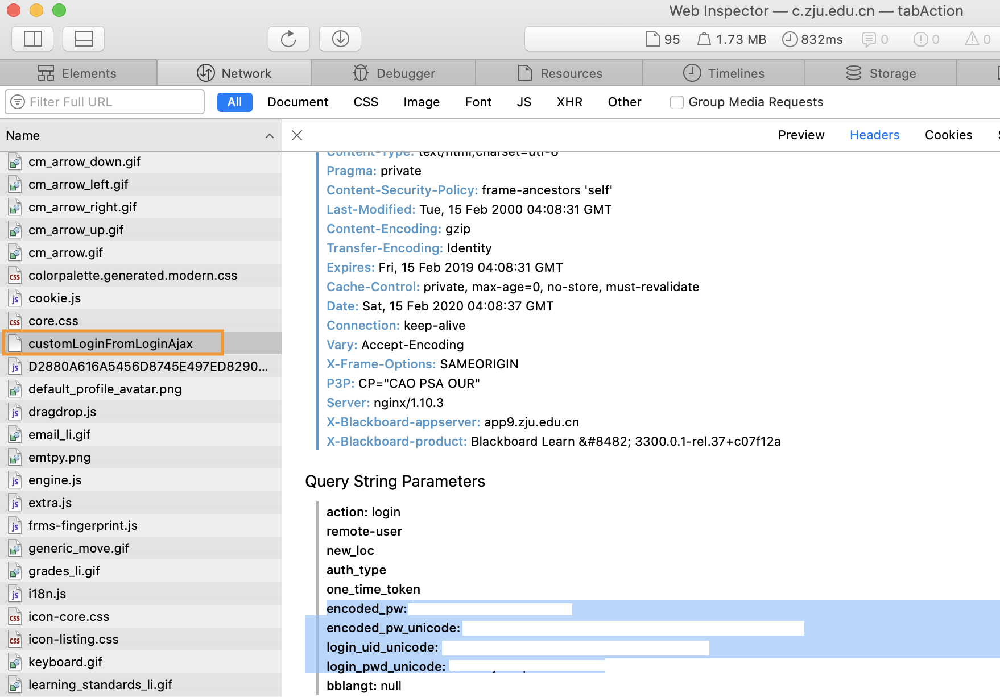

# Unofficial Python API for ZJU Blackboard Alerts Automation

Unofficial Python API for alerts (updates) in ZJU Blackboard (c.zju.edu.cn).


This repo is consist of two parts: ZJU Blackboard API ([zju_blackboard.py](zju_blackboard.py)) and a full demo program of
fetching alerts and convert them into Things (an macOS to-do app) entries ([blackboard2things.py](blackboard2things.py)).

Notice that this is unofficial. Use at your own risk.

## Demo blackboard2things.py

This demo fetches alerts and convert them into Things (an macOS to-do app) entries. To use it directly, macOS and Things 3 is required.

Change config.py before your use (See below for login parameters `ENCODED_PW`, `ENCODED_PW_UNICODE`, `LOGIN_UID_UNICODE`, `LOGIN_PWD_UNICODE`, and you may want to change `DOWNLOAD_PATH` and `COURSE_CODE_TO_NAME` as well.)

```shell
pip3 install -r requirements.txt
```

```shell
python3 blackboard2things.py
```

## API usage

Download [zju_blackboard.py](zju_blackboard.py). See requirements.txt for dependencies (py_applescript is not required, only for blackboard2things.py).

```py
from zju_blackboard import *

s = ZJUBlackboardSession()

s.login(ENCODED_PW, ENCODED_PW_UNICODE, LOGIN_UID_UNICODE, LOGIN_PWD_UNICODE)  # see below for explaination of these parameters

entries = s.get_raw_entries()  # fetch all alerts (updates) in list of JSON objects

alerts = s.process_raw_entries(entries)  # process raw JSON objects into alert objects

for alert in alerts:
    # Do something
```

### About Login Parameters
These parameters come from post request at login page (c.zju.edu.cn). Use your favourite tool to extract them. For example, in Safari:



### Get Alert Infomation

For all event types:
* `alert["title"]`: title of alert
* `alert["course_id"]`: id of course, such as `_4069_1`
* `alert["url"]`: content url without base_url (https://c.zju.edu.cn). Maybe empty for some type of alert
* `alert["event"]`: one of the following
  * `"content:available"`
  * `"course:available"`: 
  * `"announcement:available"`: 
  * `"grade:update"`
  * `"grade:manual_update"`
  * `"grade:overdue"` (showing "overdue" on blackboard, unsure what does it mean yet...)
  * `"assignment:available"`: 
  * `"assignment:due_available"` (showing "due" on blackboard, but I think it means due time available)
  * `"unknwon"` (unhandled type)
* `alert["dismiss_id"]`: ID for `dismiss_alert()`
* `alert["exception"]`: `None` if the alert is processed normally. String of exception if error happened/
* `alert["raw"]`: original JSON entry

For specific event types:
* For `alert["event"] == "content:available"`
  * `alert["content_type"]`: one of the following
    * `"file"`: a single file. Its inner url is `alert["file_url"]`, which can be used in `download_file()`.
    * `"document"`: a document with content and possibly attachments. `alert["doc_url"]` can be used for `interpret_document()`.
    * `"blank"`: blank page (but actually may not). Please view the original page on BB.
    * `"media"`: media page. Please view the original page on BB.
    * `"forum_link"`: formu link. Please view the original page on BB.
    * `"video""`: BB video. Please view the original page on BB.
    * `"unknown`: unhandled content type.
* For `alert["event"] == "announcement:available"`
  * (Possibly, or `None`) `alert["announcement"]`: content of announcement (text of unescaped HTML).
* For `alert["event"] == "assignment:due_available"`
  * `alert["assignment"]`: name of assignment
* For `alert["event"] == "assignment:available"`
  * `alert["assignment"]`: name of assignment
  * `alert["url"]` can be used for `interpret_assignment_page()`
* For `alert["event"] == "grade:update"`
  * `alert["grade"]`: name of graded item

### Dismiss Alert
```py
s.dismiss_alert(alert["dismiss_id"])
```

The alert will no longer shown on the website either.

### Download File
```py
success, filename, size = s.download_file(alert["file_url"], DOWNLOAD_PATH, MAXIMAL_DOWNLOAD_SIZE)
```

### Interpret Document Page

`interpret_document()` further look into content of document url.

```py
if alert["content_type"] == "document":
    doc_data = s.interpret_document(alert["doc_url"])
    if doc_data is not None:
        document_content = doc_data["text"]
        for download_url in doc_data["attachments"]:
            s.download_file(download_url, DOWNLOAD_PATH)
```

### Interpret Assignment Page

`interpret_assignment_page()` further look into content of assignment page url.

```py
if alert["event"] == "assignment:available":
    ret = p.interpret_assignment_page(alert["url"])
    if ret is not None:
        assignment_content = ret["content"]
        for attachment in ret["attachments"]:
            s.download_file(attachment, DOWNLOAD_PATH)
```

## Miscellaneous
* Both py program output debug message to STDERR.
